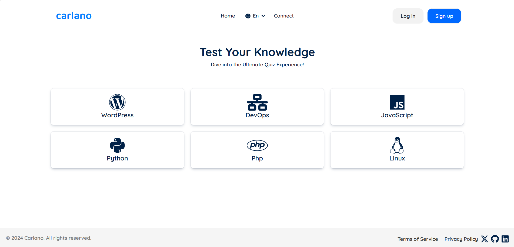
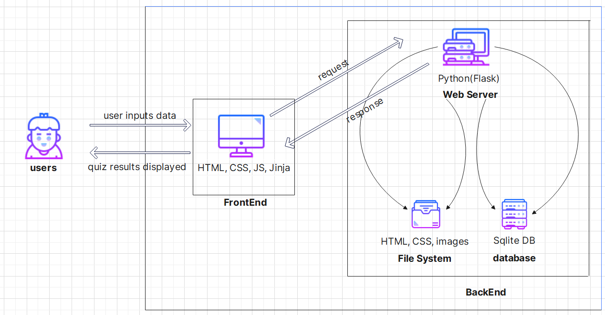

# Carlano Tech Quiz App

<div id="header" align="center">
  
</div>

<div id="badges" align=center>
  <a href="https://www.linkedin.com/in/percy-magombedze-ab0979268/">
    
  </a>
  <a href="https://twitter.com/P_Magombedze">
    
  </a>
</div>

## Project Description
Carlano Tech Quiz App, as the name suggests is a quiz web application. The quizzes are only computer science related for example python, wordpress, javascript etc. A user visits the website and in order to start attempting the quizzes, they need to sign up first and then sign in. Once signed in, the user can then start tackling the quizzes. The user's score is saved and his/her results are presented to him/her and the web app will tell that person the areas he/she needs to improve. The web app does not contain a fixed number of questions but as the admin, I can add other quiz questions to the web app, and also make changes for example, let’s say the answer of 1+1 was said to be 3 instead of 2, I can make use of `REST API` to make some put requests and update items. The Carlano Quiz web app is very user friendly. All you need is just a keyboard, mouse and of course a good internet connection to start testing your knowledge. Below is the home page of the web app.


<div align="center">
  
</div>

## Setup

It is quite easy to run the web app. The steps are as follows:
```
percy@percy:~$ git clone https://github.com/PMagombedze/Carlano-Quiz-App.git

percy@percy:~$ cd Carlano-Quiz-App

percy@percy:~$ python3 -m pip install -r requirements.txt

percy@percy:~$ python3 app.py
```

Quite easy right? Just like that and you are good to use the quiz web app.

## Architecture Overview
Okay, so let's now look at the architecture of the quiz web app so that we get a better understanding of how the app works.

<div align="center">
  
</div>


## Technologies Used

* Backend
    * SQLite DB
    * SQLAlchemy
    * Flask
* FrontEnd
    * Tailwind CSS
    * DaisyUI
    * Jinja Templating
    * FontAwesome JS
    * Sweet Alert JS